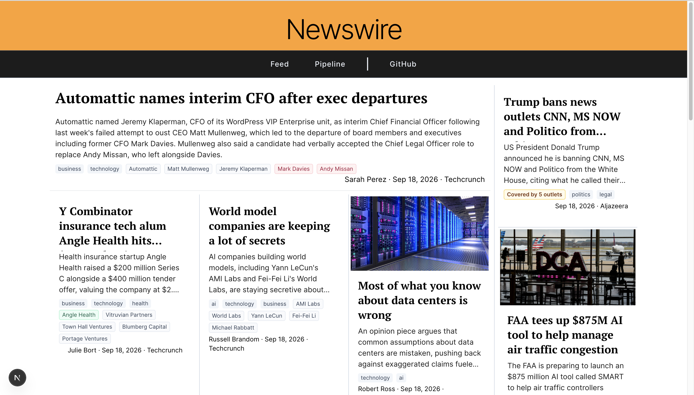
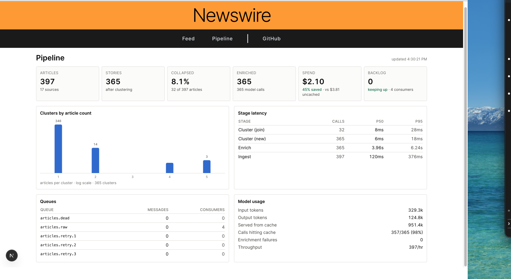

# Newswire

A real-time news pipeline that ingests RSS from 17 outlets, groups articles
covering the same event into stories, and extracts structured metadata with an
LLM — then serves the result as a live feed with a metrics dashboard.

```bash
git clone https://github.com/nchatpolarak1/newswire && cd newswire
docker compose up
```

Feed at [localhost:3000](http://localhost:3000), metrics at
[localhost:3000/pipeline](http://localhost:3000/pipeline), broker admin at
[localhost:15672](http://localhost:15672) (`newswire` / `newswire`).

No API key needed to try it — enrichment falls back to rule-based extraction and
everything else behaves identically. Set `ANTHROPIC_API_KEY` in your environment
(or a local env file, which Compose reads) for model extraction.

---

### The feed

Stories, not articles. The amber badge marks a story several outlets ran — hover
it for the list. Summaries and the entity chips below them come from the model;
chip colour is that entity's treatment *in that article*, so one story can carry
a negatively-framed company beside a neutral country.



### The pipeline dashboard

Every figure here is read from events the pipeline wrote as it ran, not
estimated. Enrich p50 is 33x ingest p50, which is why latency is a table and not
a chart — on a shared axis the fast stages would be invisible.



---

## Architecture

```
  17 RSS feeds
       │
       ▼
  ┌─────────┐  article.raw.{source}  ┌──────────────┐
  │ poller  │ ─────────────────────► │   RabbitMQ   │
  └─────────┘  URL seen-set (Redis)  │ topic: news  │
                                     └──────┬───────┘
                                            │ prefetch 8, manual ack
                            ┌───────────────┼───────────────┐
                            ▼               ▼               ▼
                      ┌──────────┐    ┌──────────┐    ┌──────────┐
                      │ enricher │    │ enricher │    │ enricher │  ◄── scale N
                      └────┬─────┘    └────┬─────┘    └────┬─────┘
                           │ fetch body → cluster → extract
          ┌────────────────┼────────────────┐
          ▼                ▼                ▼
   ┌────────────┐   ┌────────────┐   ┌──────────────┐
   │  Postgres  │   │   Redis    │   │articles.dead │
   │ articles   │   │ TF-IDF     │   │    (DLQ)     │
   │ clusters   │   │ index +    │   └──────────────┘
   │ events     │   │ feed cache │
   └──────┬─────┘   └─────┬──────┘
          └───────┬───────┘
                  ▼
           ┌─────────────┐
           │  Flask API  │  feed · clusters · stats · SSE
           └──────┬──────┘
                  ▼
            Next.js — live feed + metrics dashboard
```

Seven services. The enricher is the only one that scales:
`docker compose up --scale enricher=4`.

---

## How it works

### Two layers of deduplication, doing different jobs

**Exact URL** (poller). A Redis `SET NX` seen-set stops a story being
republished every cycle while it remains in the feed. Being atomic, it also
keeps two poller replicas from both claiming the same URL. URLs are normalised
first — tracking parameters, fragments, case and trailing slashes stripped — so
cosmetic variants collapse to one identity.

**Same story, different outlet** (enricher). URL identity cannot see that the
BBC and the Guardian are covering one event. That needs text similarity.

### TF-IDF clustering over a Redis inverted index

Each article becomes an L2-normalised TF-IDF vector. Its heaviest terms are
posted to Redis sets, so a new article's candidates are the union of postings
for *its* top terms rather than a scan of everything stored. Cosine runs only
against those candidates; the best above threshold joins that cluster.

Measured: **median 16 candidates examined, p95 40**, against 397 for a full scan.

> **This was originally SimHash, and SimHash does not work for this problem.**
> Over 393 real articles it produced *zero* pairs within Hamming distance 12,
> and its closest pairs were unrelated stories — "Iranian actor faces threats"
> and "New Bolivian cat" scored 15 apart. SimHash detects near-duplicate *text*:
> the same document with small edits. Two outlets covering one event share
> vocabulary but almost no three-word shingles, so they score as far apart as
> unrelated articles. TF-IDF weights the rare shared terms — the proper nouns
> and numbers that actually identify a story — which is the signal that exists
> here.

The threshold (0.35) was read off the measured score distribution, not picked:
0.40–0.50 is clean same-story pairs, 0.30–0.40 still holds, and topical false
positives begin below that.

### Enrichment, once per story

Only the article that opens a cluster is enriched. Later members are the same
story from another outlet, so extracting again would pay the model repeatedly
for one result — clustering first makes spend proportional to stories rather
than articles.

The system prompt is byte-identical on every request and carries a cache
breakpoint, so its 1,638 tokens are read from cache after the first call.
**Its length is load-bearing:** Sonnet will not cache a prefix below ~1,024
tokens, and a 4-chars-per-token estimate had put this prompt at ~1,090 — close
enough that trimming it would have dropped it under the floor with nothing
visibly broken.

---

## Design decisions

**Idempotent consumers, not exactly-once.** `url_hash` is unique and inserts use
`ON CONFLICT DO NOTHING`, so a redelivered message is a no-op rather than an
error. Ack happens only after the transaction commits. Verified by republishing
all 395 stored articles and confirming the row count did not move.

**Retries re-publish rather than requeue.** `nack(requeue=True)` returns a
message to the head of the queue carrying no counter, so a poison message spins
forever. Instead the retry budget rides on the message in a header, and each
attempt parks it in a consumer-less queue whose `x-message-ttl` dead-letters it
back after 2s, 8s, then 32s. **The broker does the waiting**, so no consumer
capacity is spent on backoff.

**Enrichment runs outside the insert transaction.** At a p50 of 4 seconds,
holding one of eight pooled connections across the model call would starve the
pool with four replicas at prefetch 8.

**Queue depth comes from the management API**, not a passive queue declare — the
declare's count lags on the publishing channel and reads low exactly when the
queue is backing up.

**Keyset pagination, not `OFFSET`.** The feed grows at the head while a reader
pages; `OFFSET` would silently skip or repeat rows as it shifts.

**Redis is a cache here, not a database.** It holds the TF-IDF index, the URL
seen-set, and a 20-second copy of the feed's first page. If it throws, the API
logs and serves from Postgres anyway. *(This project began as a teaching
exercise where Redis was the database and the whole dataset lived under a single
key.)*

**Crawling is polite.** The fetcher identifies itself honestly, checks
`robots.txt` before requesting, and treats a 403 as a normal outcome that
degrades to the feed's teaser. Eight of seventeen sources refuse automated
access; none of them are worked around.

---

## What doesn't work well

**The dedup rate is 8.1%, not 30%.** The original plan guessed 30% with nothing
behind it. The real figure depends heavily on corpus size — IDF needs a corpus
before rare terms look rare — and climbs as the feed accumulates. Any published
rate is meaningless without the corpus size attached.

**Roughly 4 of 17 multi-article clusters are topical, not same-story.** Four CBS
Iran pieces merged on shared vocabulary; a podcast episode listing paired with a
real story. Raising the threshold to 0.40 cuts most of these but also drops
genuine members. Left at 0.35 pending more data.

**41% of articles are teaser-only.** Eight sources return HTTP 403/401 to any
identified crawler and one is JS-rendered. Those articles carry ~300 characters
instead of ~5,000, which weakens both clustering and extraction for them.

**The SSE stream polls Postgres every 3 seconds per connected client.** Adequate
for a demo; `LISTEN/NOTIFY` or a Redis pub/sub fan-out would be needed for real
concurrency.

**There are no integration tests.** The 48 unit tests cover the similarity and
enrichment logic — the parts where correctness is subtle. Queue semantics,
idempotency and the DLQ were verified by hand against live infrastructure and
are documented in the commit history, not automated.

---

## Local development

```bash
docker compose up -d                      # everything
docker compose up -d --scale enricher=4   # scale the consumer
docker compose logs -f enricher           # watch it work
docker compose down -v                    # reset all state
```

Python tooling runs outside Docker:

```bash
python3 -m venv .venv && .venv/bin/pip install -e ".[dev]"
.venv/bin/pytest          # 48 tests
.venv/bin/ruff check .
```

**Port conflicts are the most likely setup problem.** The compose file binds
5432, 6379, 5672, 15672, 8000 and 3000. A Homebrew Redis or Postgres already
listening on `127.0.0.1` will shadow Docker's binding for host-side scripts
while containers keep talking to their own instance — a split-brain that is very
confusing to debug. Check with `lsof -nP -iTCP:6379 -sTCP:LISTEN`.

## Layout

```
pipeline/     config, db, queue topology, fulltext, similarity, clustering, enrich, prompts
services/
  poller/     RSS fetch, extraction, publish
  enricher/   consume loop, delivery semantics, article handling
  api/        Flask: feed, clusters, stats, SSE
web/          Next.js feed + metrics dashboard
tests/        48 unit tests
```

Python 3.12 · Flask · RabbitMQ · Postgres 16 · Redis 7 · Next.js 15 · Claude Sonnet
